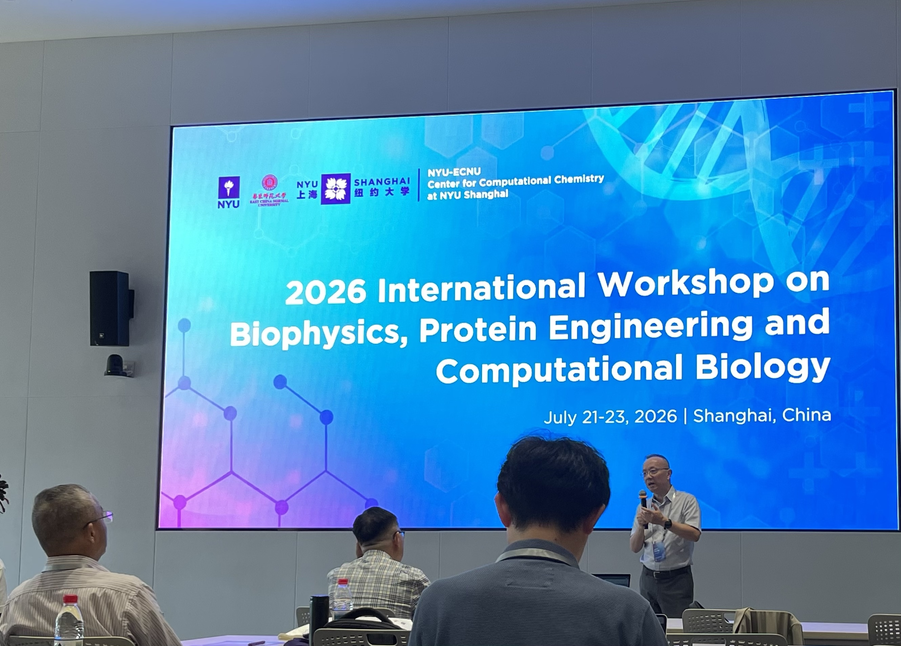
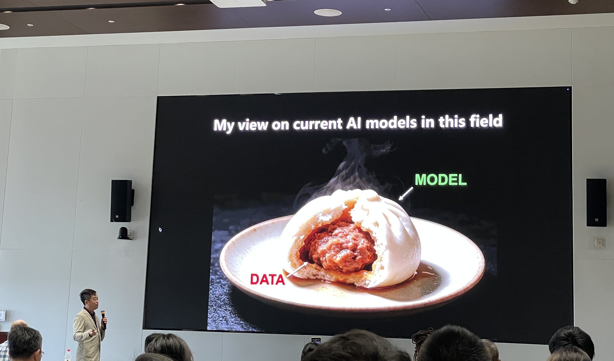

Weiwei He presented his research at the **2026 International Workshop on Biophysics, Protein Engineering and Computational Biology**, held at **NYU Shanghai** on July 21–23, 2026.

The workshop brought together researchers working across biophysics, protein engineering, computational biology, artificial intelligence, and molecular simulation. It provided valuable opportunities to exchange ideas, discuss emerging research directions, and build new scientific connections.

