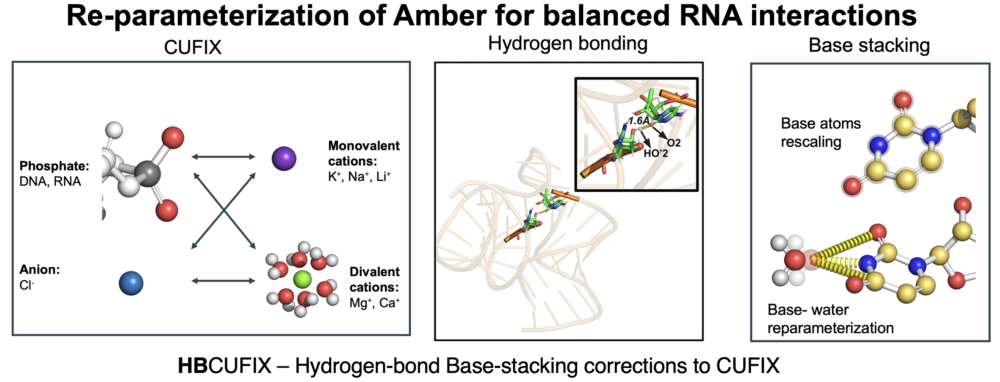

## Overview

HB-CUFIX is an RNA force-field refinement developed using small-angle X-ray scattering (SAXS) experiments. It extends the CUFIX corrections by improving hydrogen-bonding and base-stacking interactions, allowing molecular dynamics simulations to reproduce RNA structures and conformational dynamics more accurately.

The force field has been evaluated using helix-junction-helix RNA duplexes and single-stranded RNA systems, providing improved descriptions of both structured and flexible RNA molecules.



*HB-CUFIX extends the CUFIX framework through refined hydrogen-bonding and base-stacking interactions for RNA simulations.*

## Key Features

- Refined against experimental SAXS measurements
- Extends the original CUFIX corrections for RNA
- Improves hydrogen-bonding and base-stacking interactions
- Benchmarked using helix-junction-helix RNA duplexes
- Evaluated with flexible single-stranded RNA systems
- Compatible with GROMACS molecular dynamics simulations
- Designed to improve RNA structural and dynamic ensembles

## Software and Force-Field Files

The HB-CUFIX force-field files are available from the following repository:

- [GitHub repository](https://cobailab.github.io/downloads/software)
- [GitLab repository](https://gitlab.com/KirmizialtinLab/hb_cufix)

## Installation

Copy the GROMACS-compatible force-field folder into your working directory:

```bash
cp -r HB_cufix_RNA.ff /path/to/your/working/directory/
```

## Associated Publication

Weiwei He, Nawavi Naleem, Diego Kleiman, and Serdal Kirmizialtin.  
**“Refining the RNA Force Field with Small-Angle X-ray Scattering of Helix-Junction-Helix RNA.”**  
*The Journal of Physical Chemistry Letters* **2022**, **13**, 3400–3408.  

[View Publication](https://doi.org/10.1021/acs.jpclett.2c00359)
